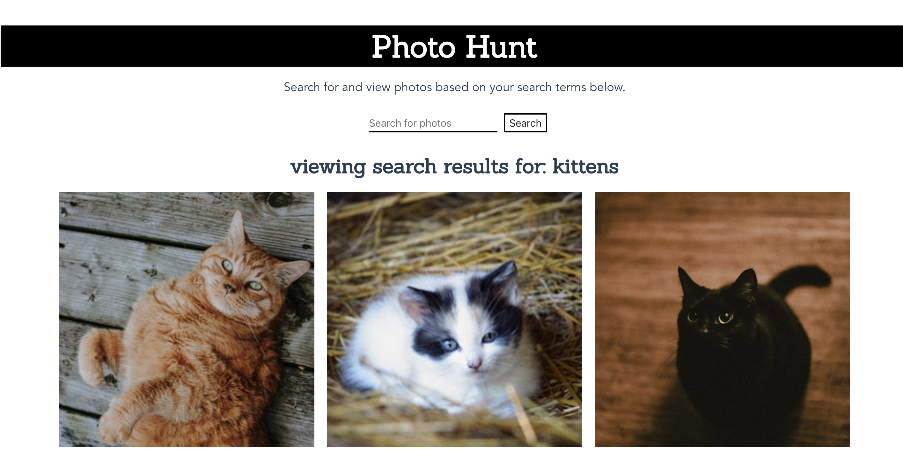

# Photo Hunt

Photo Hunt is a single page application built in Vue.js that uses the [Unplash API](https://unsplash.com/developers) to allow users to search for and view photos that relate to the search terms.

This app is deployed to GitHub pages. View it live [here](https://tmcmeans.github.io/photo-hunt/).

## Project setup

```
Go to https://unsplash.com/developers to sign up for a API access key
```

```
In your terminal:

$ git clone https://github.com/TMcMeans/photo-hunt

$ cd into the 'photo-hunt' directory
```

```
Install dependencies:

$ npm install
```

```
Start the server or run tests:

$ npm run serve

$ npm run test:unit
```

## Project goals

My goals for this project were to test and create a front-end application with a seamless UI in a Javascript framework that I am unfamiliar with.

## Technologies and Resources

- Vue.js
- Vue Router
- HTML/CSS
- Jest (testing)
- Axios (HTTP client)

## Developers

[Tanjie McMeans](https://github.com/TMcMeans)

## Implementation


